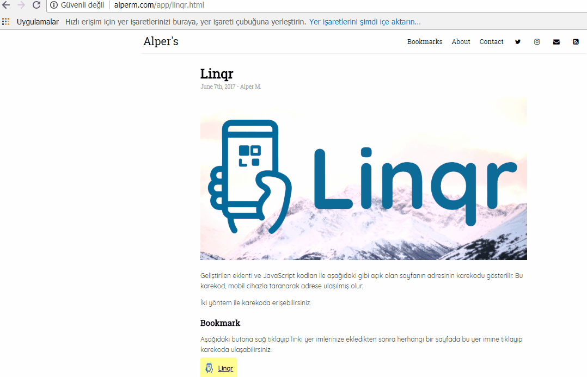
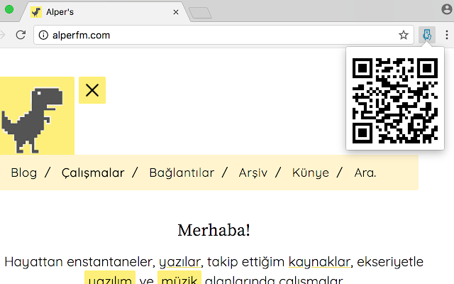

You can get opened page URL on any devices from your mobile device by scanning generated QR Code. To get QR Code of current page, you can use bookmarklet or add-ons. 

You can choose any of them. 
*I recommend bookmarklet* &#9786;

### Bookmark &#9733;

First, add a button to your bookmarks. Set address as given code at **bookmark/linqr.js** Then, click bookmark to get the QR Code of page you have just opened.

***

### Browser Extensions

You can install from links below:

* [Google Chrome](https://chrome.google.com/webstore/detail/linqr/lafmogkhpjleigddjenkdpjcadohhhjc?hl=en-US)
* [Mozilla Firefox](https://addons.mozilla.org/addon/linqr/)

***

#### TODO
* fix qrcode generating function for too long urls
* fix z-index in some pages
* **develop mobile application for qr code purpose**
